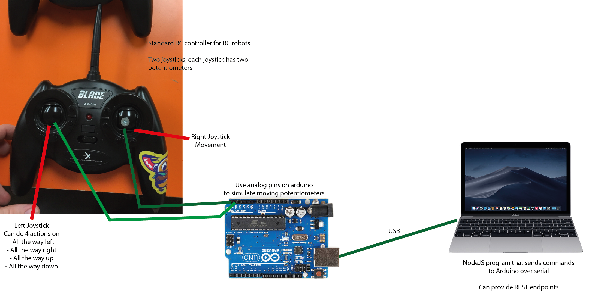

# BotBash RC

Provides a REST endpoint to control TasBot for BotBash over RC with the help of an Arduino.

- REST endpoint is default on port 8080 and can be set with the `PORT` environment variable.
- Default COM port is `/dev/ttyACM0`, can be set with the `COMPORT` environment variable.
- Before starting, install the dependencies with either yarn (execute `yarn` in the cloned directory) or npm with`npm --install`. Then build with `yarn build` and start with `yarn serve` (or with npm).

The setup is as follow:

## Debugging

Use `yarn start` to automatically restart when a change is detected in the source code.

